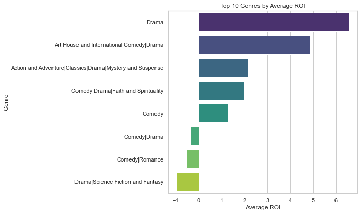
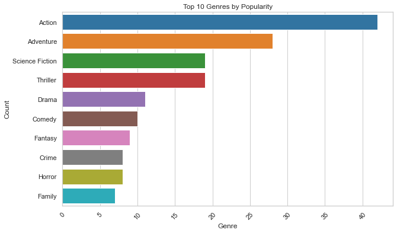
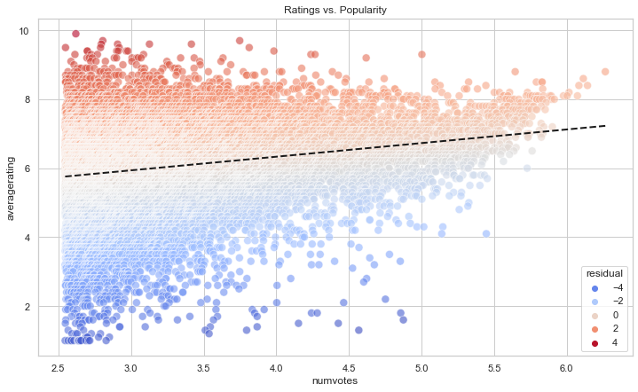
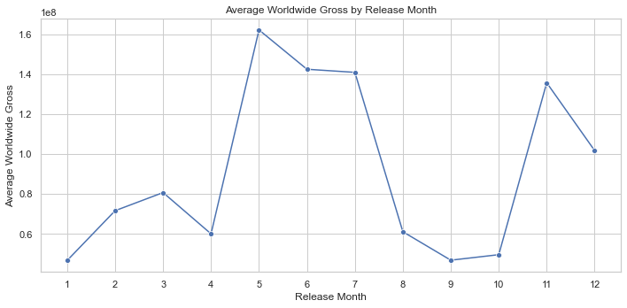

# Movie Studio Business Insights - README
## Project Overview
This project provides data-driven insights for a new movie studio looking to produce original video content. Through exploratory data analysis of movie data from various sources (Rotten Tomatoes, The Numbers, IMDB, and TMDb API), we identify trends, patterns, and business opportunities in the film industry.
## Project Team
Valentine Kweyu

Shem Nderitu

Mercy Barminga

Timothy Kamwilwa

Beatrice Kiilu

Nelson Muia

Sharon Chebet
## Key Objectives
1. Analyze movie performance metrics (ratings, box office, ROI)

2. Identify profitable genres and budget ranges

3. Discover correlations between movie attributes and success

4. Provide actionable recommendations for the new studio
## Notebook Structure
### 1. Business Understanding
- Problem statement and objectives
- Stakeholder identification
### 2. Data Preparation
- Loading datasets from multiple sources
- Data cleaning and preprocessing
- Feature engineering (ROI calculation)
### 3. Data Analysis & Visualization
1. Budget and ROI analysis

2. Genre performance trends

3. Popularity and rating patterns

4. Temporal analysis of movie releases

## Requirements
To run this notebook, you'll need:
- Python 3.7+
- Libraries: pandas, numpy, matplotlib, seaborn, requests, sqlite3, gzip, scipy, sklearn
- TMDb API key (for movie database access)
## How to Run
1. Install requirements: **pip install -r requirements.txt**
2. Place all data files in **zippedData/** directory:
    - Rotten Tomatoes (**rt.movie_info.tsv.gz,rt.reviews.tsv.gz**)
    - The Numbers (**tn.movie_budgets.csv.gz**)
    - IMDB (**im.db**)
3. Add your TMDb API key in the relevant section
4. Execute cells sequentially in **workbook_2.ipynb**
## Key Findings
1. Budget-ROI Relationship: Mid-budget films ($50-100M) show optimal ROI
2.  Focus on creating films that combine critical excellence with broad appeal rather than chasing pure popularity or niche critical darlings.
3. Use genre-specific campaigns.
## Actionable Recommendations
1. Focus on Action/Adventure films with $50-100M budgets
2. Target summer release windows for blockbuster potential
3. Prioritize quality (aim for IMDB ratings >8.5) over quantity